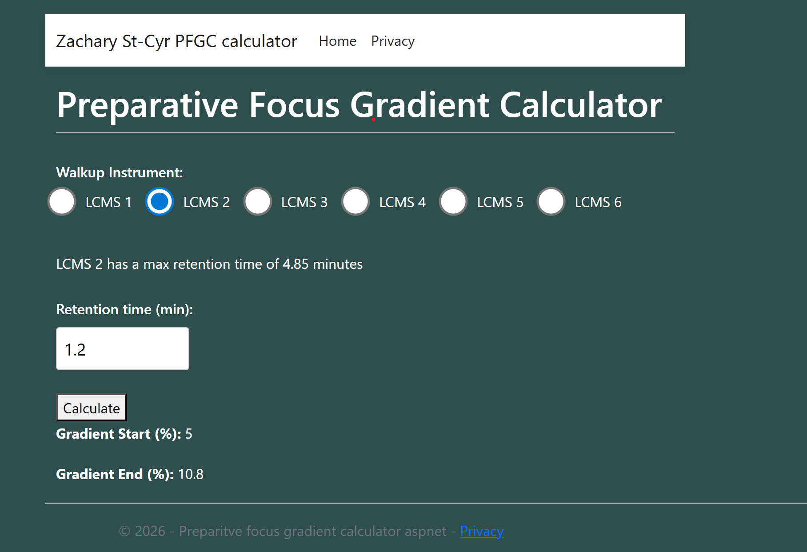
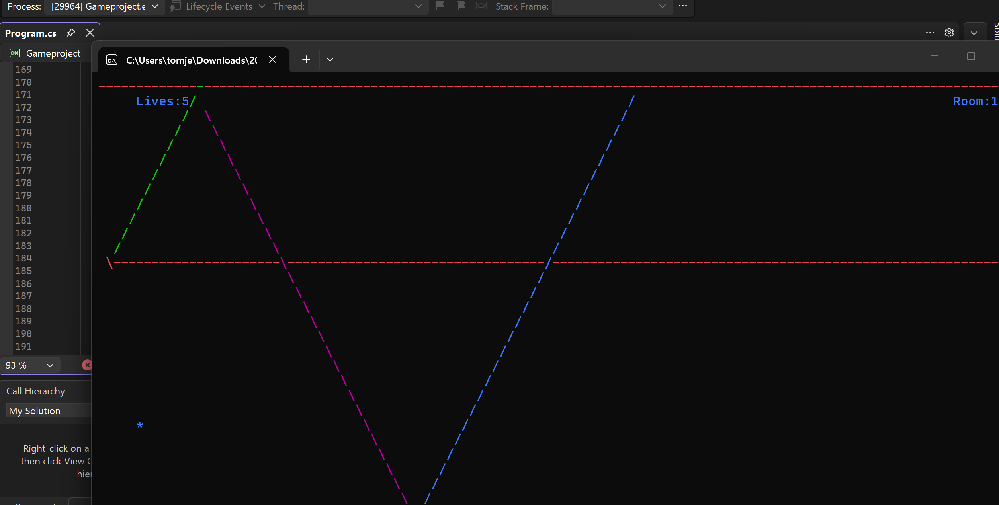

# My projects - Zachary St-Cyr

 ### Preparitive Focus Gradient Calculator
   This was a personal project for my father, who needed a simple calculator website for a machine he used frequenly at his lab.
   I used HTML, CSS and Javascipt with the use of Microsoft Azure to deploy my project into a real online website

   Heres a code snippet from the Javascipt. This was for handling edge cases for when the "range" was <=5 or >= 100.
   ```
   const data = await response.json();

 var start_gradient = (data.answer - 10).toFixed(1);
var end_gradient = (data.answer + 10).toFixed(1);
   
T
var defaultstart = 5;
var defaultend = 100;

switch (true)
{

    case (start_gradient < 5): document.getElementById('output').innerText = (defaultstart);
        if (end_gradient < 5) {
            document.getElementById('output2').innerText = (defaultstart); break;
        }
        else
        {
            document.getElementById('output2').innerText = (end_gradient); break;
        }
        

    case (end_gradient > 100): if (start_gradient > 100)
    {
        document.getElementById('output').innerText = (defaultend);
    }
    else
    {
        document.getElementById('output').innerText = (start_gradient);
    }
        document.getElementById('output2').innerText = (defaultend);
        break;

    default: document.getElementById('output').innerText = (start_gradient);
        document.getElementById('output2').innerText = (end_gradient);
        break;   
}

   ```


 ### Heres a screenshot to what the website looks like:
    

 ### unfortunately, my student priviledes has run out

 ## What I've learned from this project
 I have learned the most about programming and deploying websites from what I thought would be a simple fun project for mny dad. I learned how to use multiple programming languages within one project while my previous school assignments have souly been console apps. I learned how to have Javascript interact with html, I learned the basics of a controller, how to push my project to online using visual studio, and many more nuances to programming.

 # Laser game
 For my Programming 1 final project, I made a very poor-style laser game where you had to cross the screen vertically while lasers that have the property of bouncing of the walls 3 times spawn in random spots every 5 moves. The game was total RNG, but I had fun figuring out the logic to the lasers and the game-over state
### The asterix is the character, the slash at the left is a mirrow, and the line at the top is the finish line

An example of why my code was a bit "bad practice" was that my functions where way too long. Heres my checkifhit function I placed everywhere to ensure I "died" when the laser spawned on me instead of phasiong through me:
``` 
static void checkifhit()
{
    if (MeY == lasershooterrightY)
    {
        MeX = 5;
        MeY = Console.WindowHeight - 1;
        Console.SetCursorPosition(MeX, MeY);
        Console.Write("");
        diedscreen();

    }

    //first beam 
    for (int i = 0; i < storedposX1.Length; i++)
    {
        if (MeX == storedposX1[i] && MeY == storedposY1[i])
        {
            MeX = 5;
            MeY = Console.WindowHeight - 1;
            Console.SetCursorPosition(MeX, MeY);
            Console.Write("");
            diedscreen();
        }
    }
    //second beam 
    for (int i = 0; i < storedposX2.Length; i++)
    {
        if (MeX == storedposX2[i] && MeY == storedposY2[i])
        {
            MeX = 5;
            MeY = Console.WindowHeight - 1;
            Console.SetCursorPosition(MeX, MeY);
            Console.Write("");
            diedscreen();
        }
    }
    //third beam
    for (int i = 0; i < storedposX2.Length; i++)
    {
        if (MeX == storedposX3[i] && MeY == storedposY3[i])
        {
            MeX = Console.WindowWidth / 2;
            MeY = Console.WindowHeight - 1;
            Console.SetCursorPosition(MeX, MeY);
            Console.Write("");
            diedscreen();
        }
    }
}
```

 ## What I've learned

 This game solidified my understanding of functions, though I did abuse global variables to limit passing too much since I found that confusing at the time. If you look at the code snippet, I cleverly used arrays and loops to store the X and Y position of every character of the lasers to check if my character position and laser position where the same.

 I see now that there a lot of repeating code i couldve taken out and made into its own thing, but it was a great learning experience and im hopeful to more learning experiences like that.
    